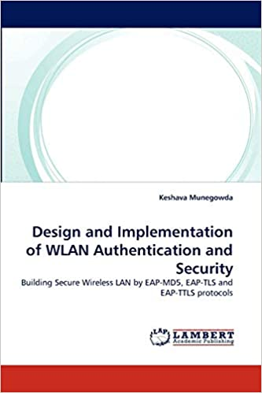
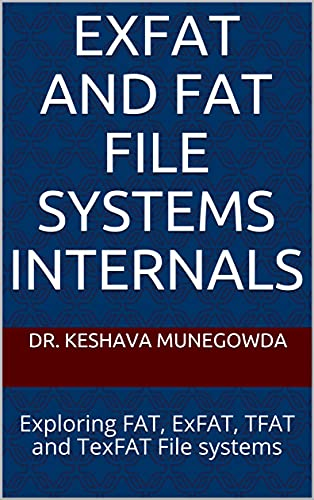

    

# Dr Keshava Munegowda
**Vice President, SecDB Engineering, Goldman Sachs, Bengaluru**

System Architect/Technical Manager.

20+ years of experience in Design, Development of File systems, Storage Systems, Cluster Infrastructure development, Software Defined Storage / Streaming Storage, Big data systems and Network Authentication and Security Protocols, Generative AI and LLMS.

# Work Experience
* Vice President, SecDB Engineering, Goldman Sachs , Since 08/2020
   * TDMS and SARAL Auto failover Implementation
   * Performance Engineering
   
* Senior Principal Engineer, DellEMC ,  02/2013 -  08/2020 
    * Pravega Performance Engineering
    * Founder Developer of SBK
    * Competitive Analysis of Pravega  with another products Kafka, Pulsar, NATS, RabbitMQ, etc
    * Architect of DCA (Data Computing Appliance) Software
    
* Lead Engineer, Texas Instruments , 01/2006 - 02/2013
    * Design and Implementation of FAT12/16/32 File Systems
    * Design and Implementation of exFAT File system
    * Design and Implementation of USB Host controller driver
    * Design and Implementation of device drivers for MMC/SD, SATA SSDs

* Software Engineer, SASKEN Technologies , 08/2004 - 12/2005
    * Design and implementation fo device drivers for NAND, NOR Flash memories
    
* Project Trainee Engineer, Global Edge  , 07/2003 - 08/2004
    * Design and Implementation of protocols EAP, EAP-TLS, EAP-TTLS protocols for WLAN authentication and security protocol

# Skills
* Programming Languages
    * C, C++, Java, Python
    
* Operating Systems
    * Linux

* Programming Paradigms
    * Object Oriented Programming, Functional Programming, Reactive Programming
   
* Distributed Systems
    * Kafka, Pravega, HDFS, Pulsar, FoundationDB

* File Systems
    * FAT 12/16/32, exFAT, TFAT, TexFAT, F2FS, Ext3

* Storage Systems
    * Linux Block Device Drivers, SATA, NAND / NOR Flash Memories, SSDs

* Network Protocols
    * TCP/IP, SSL, EAP, EAP-TLS, EAP-TTLS
    
* Netowrk Packages
    * Netty IO

* Metrics
    * Micrometer, Prometheus, Grafana, Influx DB, StatsD

* Build Systems
    * Gradle, make, cmake

* Source Control
    * Git

* Development IDEs
    * IntelliJ

* Cloud Deployement
    * AWS, Google Cloud

# Education

* Philosophy of Doctorate (PhD), Computer and Information Systems, 2016
* Master of Technology (M.Tech), Computer Science and Engineering,  2002-2004
* Bachelor of Engineering (BE), Computer Science and Engineering, 1997 - 2001

# Patents

* US patent number: 8429331, entitled “Storage Optimizations by Directory compaction in FAT File system”
* US patent number: 8452734, entitled “FAT file in reserved cluster entry with ready entry state”
* US patent number: 9043286, entitled “IC updating File system meta data with log record data”
* US patent number: 9569447, entitled “File access method and system there of”
* US patent number: 9817837, entitled “Method and System for File storage and access”
* US patent number:13401356, entitled “Sharing input and output devices in networked systems”

# Books

* “Design and Implementation of WLAN Authentication and Security: Building Secure Wireless LAN by EAP- MD5, EAP-TLS and EAP-TTLS protocols” by Keshava Munegowda, Jun 2010. LAMBERT Publications, Berlin, Germany.

    

* “ExFAT and FAT File systems Internals: Exploring FAT, ExFAT, TFAT and TexFAT File systems” by Keshava Munegowda, Jun 2016, Amazon Digital services, ASIN: BOIHQ8PRA6,

    

# Research Publications
1. Munegowda K., Sanjay Kumar N.V. “Design and Implementation of Storage Benchmark Kit”, In: Emerging Research in Computing, Information, Communication and Applications.Lecture Notes in Electrical Engineering, vol 790, Springer,Singapore. https://doi.org/10.1007/978-981-16-1342-5_5 , 2022.
1. “Distributed Streaming storage performance benchmarking: Kafka and Pravega”, Sanjay Kumar, Dr. Keshava Munegowda, International Journal of Innovative Technology and Exploring Engineering, Page 1-8, Volume 9, Issue 2, December 2019.
1. “Avoidance Techniques for  snowball effect of wandering tree in flash memory-based File systems” , Keshava Munegowda, Dr. G T Raju, International Journal of Applied Engineering Research, Page 120-124, Volume 10, Number 86, December 2015,  URL : https://www.researchgate.net/publication/289490302
1. “Adapting Endurance and Performance Optimization Strategies of ExFAT File System to FAT File System for embedded storage devices”,  Keshava Munegowda, Dr. G T Raju, Veera Manikandan Raju, International Journal of Engineering and Technology (IJET),  ISSN : 0975-4024, Pages 204-211,  Volume 6, Issue 1, February – March 2014. URL: http://www.enggjournals.com/ijet/docs/IJET14-06-01-141.pdf
1. “Directory Compaction Techniques for Space Optimizations in ExFAT and FAT File Systems for Embedded Storage Devices”, Keshava Munegowda, Dr. G T Raju, Veera Manikandan Raju, International Journal of Computer Science Issues (IJCSI), ISSN: 1694-0784, Pages 144-150, Volume 11, Issue 1, Number 2, January 2014. URL: http://www.ijcsi.org/papers/IJCSI-11-1-2-144-150.pdf
1. “Design and Implementation of Log Structured FAT and ExFAT File Systems”, Keshava Munegowda, Dr. G T Raju, Veera Manikandan Raju, International Journal of Engineering and Technology (IJET), ISSN: 0975-4024, Pages 1708-1727, Volume 6, Issue 4, August-September 2014. URL: http://www.enggjournals.com/ijet/docs/IJET14-06-04-708.pdf
1. “Methodologies for Geotagging in FAT and ExFAT File Systems for Smart Phones”, Keshava Munegowda, Dr. G T Raju, Veera Manikandan Raju, International Journal of Computer Applications (IJCA), ISSN: 0975 – 8887, Pages 7-14, Volume 92, Number 2, April 2014. URL: http://research.ijcaonline.org/volume92/number2/pxc3894892.pdf
1. “Evaluation of File Systems for Solid State Drives”, Keshava Munegowda, Dr. G T Raju, Veera Manikandan Raju, in Proceedings of  2nd International Conference on Emerging Research in Computing, Information, Communication and Applications (ERCICA) , Elsevier, Bangalore, Karnataka ,India, August -2014.
1. “Power  Fail-Safe FAT File System”, Keshava Munegowda, Dr. G T Raju, in proceedings of Embedded Linux Conference (ELC), San Francisco, CA, USA,  April 2011.  Presentation Video: http://free-electrons.com/pub/video/2011/elc/elc-2011-munegowda-power-fail-safe-fat-fs.webm, Presentation Slides: http://elinux.org/images/5/54/Elc2011_munegowda.pdf.
1. “The Extended FAT File System: Differentiating with FAT32 File System”, Keshava Munegowda, Venkatraman S, Dr. G T Raju, in Proceedings of Linux Conference (LC), Prague, Czech Republic, Europe, October 2011. Presentation Slides: https://events.linuxfoundation.org/images/stories/pdf/lceu11_munegowda_s.pdf
1. “Cluster Allocation strategies of the ExFAT and FAT File Systems: A comparative study in embedded storage systems”, Keshava Munegowda, Dr. G. T. Raju , Veera Manikandan Raju, in Proceedings of International Conference on Advances in Computing (ICAdC), Bangalore, Karnataka ,India,  in Proceedings of Advances in Intelligent Systems and Computing (ASIC),  Springer, Pages 691-698, Volume 174, 2012.
1. “Performance And Space Optimization Techniques For Fat File System For Embedded Storage Devices”, Keshava Munegowda, Dr. G. T. Raju, Veera Manikandan Raju, in proceedings of International Conference on Data Engineering and Communication Systems (ICDECS), Bangalore, Karnataka ,India, December, 2011.
1. “FFSB and IOzone: File System Benchmarking Tools, Features and Internals”, Keshava Munegowda, Dr. G T Raju, Sourav Poddar, in Proceedings of Embedded Linux Conference (ELC), Barcelona, Spain, Europe, November 2012. Presentation video: http://free-electrons.com/pub/video/2012/elce/elce-2012-munegowda-filesystem-benchmarking.webm; Presentation Slides: http://www.elinux.org/images/f/f7/FFSB_and_IOzone-_File_system_Benchmarking_Tools,_Features_and_Internals.pdf
1. “Design Methodologies of Transaction-Safe Cluster Allocations in TFAT File System for Embedded storage devices”, Keshava Munegowda, Dr. G T Raju, Veera Manikandan Raju, Manjunath T N, in Proceedings of 13th International Conference on Information Technology (ICIT),  IEEE, Bhubaneswar, Odisha, India, December 2014.
1. “Characterization of Transaction-Safe Cluster Allocation Strategies of TexFAT File System for Embedded Storage Devices”, Keshava Munegowda, Dr. G T Raju, Veera Manikandan Raju, Manjunath T N, in Proceedings of International Conference on Computational Intelligence in Data Mining (ICCIDM), Burla, Odisha, India, in Proceedings of Smart Innovation , Systems and Technologies, Springer, December 2014.
1. Keshava Munegowda, “Secure password based authentication in WLAN", Journal of Indian Institute of Science (IISc), July-August 2006. http://journal.library.iisc.ernet.in/vol200604/paper8/389.pdf
